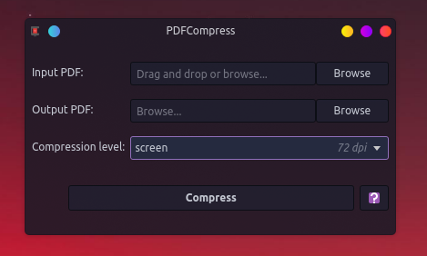

# PDFCompress

Compress PDF files using Ghostscript.

# Requirements

* Python 3
* PyQT 6
* Ghostscript

# Usage

## Command line

[northernlights@computa pdf-compress]$ ./pdfcompress.py -h
usage: pdfcompress.py [-h] [-i INPUT] [-o OUTPUT] [-c {screen,ebook,prepress,printer,default}]
[-f] [--version]

Compress a PDF file using Ghostscript.

options:
-h, --help            show this help message and exit
-i, --input INPUT     Path to the input PDF file (default: None)
-o, --output OUTPUT   Path to the output compressed PDF file (default: None)
-c, --compression {screen,ebook,prepress,printer,default}
Compression level: default, screen (72 dpi), ebook (150 dpi), printer
(300 dpi), prepress (highest) (default: default)
-f, --force           Force overwrite of output file without confirmation (default: False)
--version             show program's version number and exit

## QT Interface

